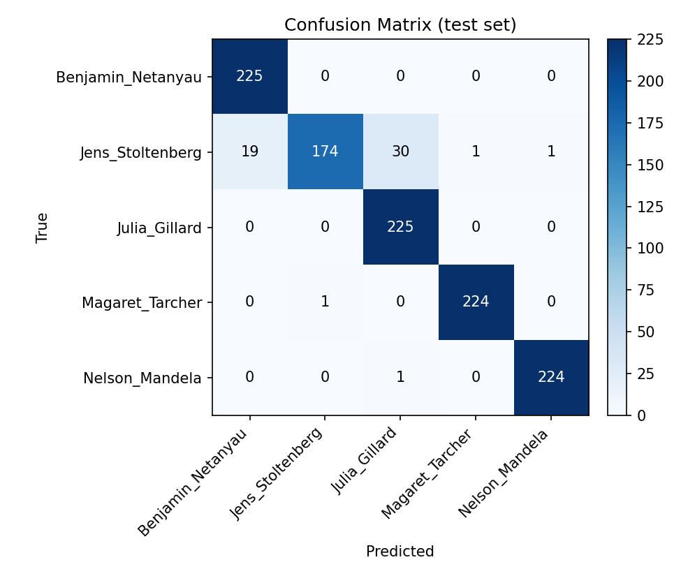

# 🎙️ Speaker Recognition System


A deep learning system that identifies **who is speaking** from a 1-second audio clip, using a 1D residual convolutional neural network trained on the FFT spectrum of raw audio.

Trained and evaluated on the [Speaker Recognition Dataset](https://www.kaggle.com/datasets/kongaevans/speaker-recognition-dataset) (Kaggle) — 5 well-known public speakers + background noise.

**🔗 Live demo:** _add your Streamlit Community Cloud link here once deployed (see [Deployment](#try-it-interactively) below)_

## Contents
- [Results](#results)
- [Why this version is a full rewrite](#why-this-version-is-a-full-rewrite)
- [Try it interactively](#try-it-interactively)
- [Model architecture](#model-architecture)
- [Project structure](#project-structure)
- [Getting started](#getting-started)
- [Dataset](#dataset)
- [Possible extensions](#possible-extensions)
- [License](#license)

## Results

| Metric | Score |
|---|---|
| **Test accuracy** | **95.29%** on 1,125 held-out samples |

<p align="center">
  
</p>

| Speaker | Precision | Recall | F1-score |
|---|---|---|---|
| Benjamin Netanyahu | 0.92 | 1.00 | 0.96 |
| Jens Stoltenberg | 0.99 | 0.77 | 0.87 |
| Julia Gillard | 0.88 | 1.00 | 0.94 |
| Margaret Thatcher | 1.00 | 1.00 | 1.00 |
| Nelson Mandela | 1.00 | 1.00 | 1.00 |

## Why this version is a full rewrite

An earlier version of this project used a single Dense layer on top of the **time-averaged MFCCs** of each clip — averaging over time throws away almost all of the temporal/spectral detail in the signal, the code relied on hardcoded local file paths, and none of the preprocessing objects were persisted, so the saved model couldn't actually be reused for inference.

This version instead:
- Feeds the **full FFT magnitude spectrum** of the raw waveform into a **1D residual CNN**, so the network can learn which frequency patterns distinguish each speaker instead of working from a single averaged vector.
- Applies real **background-noise augmentation** during training (mixed in at a random SNR) for robustness.
- Is organized as a proper Python package (`src/`) with a clean train / evaluate / predict split, instead of a single notebook.
- Saves every artifact needed to actually reuse the model: the trained weights, the class-name mapping, training curves, and a full evaluation report — not just the `.h5` file.
- Runs from a portable, relative dataset path — no machine-specific paths.

## Try it interactively

This repo includes a small **Streamlit** app (`app.py`) — upload any `.wav` clip or pick one of the bundled sample clips, and see the predicted speaker with a confidence bar chart.

Run it locally:
```bash
pip install -r requirements.txt
streamlit run app.py
```

### Deploy it for free (so recruiters can try it live)
The easiest option is **[Streamlit Community Cloud](https://streamlit.io/cloud)**:
1. Push this repo to GitHub (already done if you're reading this on GitHub 🙂).
2. Go to [share.streamlit.io](https://share.streamlit.io), sign in with GitHub, click **"New app"**.
3. Pick this repository, branch `main`, and set the main file to `app.py`.
4. Click **Deploy** — it builds automatically from `requirements.txt` and gives you a public URL in a couple of minutes.

Alternatives that work the same way: **[Hugging Face Spaces](https://huggingface.co/spaces)** (choose the Streamlit SDK) or **[Render](https://render.com)** for a Docker-based deployment. All three are free for a small demo like this one.

## Model architecture

Raw 1-second waveform (16kHz) → FFT magnitude → 5 residual Conv1D blocks (16→32→64→128→128 filters) → average pooling → dense layers → softmax over 5 speakers.

## Project structure

```
Speaker-Recognition-System/
├── app.py                # Streamlit demo (upload a clip, get a live prediction)
├── src/
│   ├── config.py       # all paths & hyperparameters in one place
│   ├── dataset.py       # loading, stratified split, noise augmentation
│   ├── model.py         # the residual 1D CNN architecture
│   ├── train.py         # training loop, checkpointing, metrics/plots
│   ├── evaluate.py      # re-evaluate the saved checkpoint (no retraining)
│   ├── predict.py       # CLI inference on new .wav files
│   └── utils.py
├── models/               # saved model weights, label map, metrics.json
├── assets/               # confusion matrix, training curves, sample clips
├── tests/                # unit tests (pytest)
├── requirements.txt
└── README.md
```

## Getting started

### 1. Install dependencies
```bash
pip install -r requirements.txt
```

### 2. Get the dataset
Download the [Speaker Recognition Dataset](https://www.kaggle.com/datasets/kongaevans/speaker-recognition-dataset) from Kaggle and extract it so that `16000_pcm_speeches/` sits at the project root (next to `src/`).

### 3. Train
```bash
python -m src.train
```
This trains the model, then automatically saves the trained weights, class names, training curves, and a full evaluation report (metrics + confusion matrix) under `models/` and `assets/`.

### 4. Re-evaluate the saved model (optional)
```bash
python -m src.evaluate
```
Re-runs evaluation on the held-out test set using the already-saved checkpoint, without retraining — regenerates `models/metrics.json` and `assets/confusion_matrix.png`.

### 5. Predict on a new audio file
```bash
python -m src.predict path/to/clip.wav
```
```
path/to/clip.wav
  -> Predicted speaker: Nelson_Mandela  (confidence: 99.93%)
```

Audio files must be 1-second, 16kHz, mono `.wav` clips (the same format as the training data).

## Dataset

[**Speaker Recognition Dataset**](https://www.kaggle.com/datasets/kongaevans/speaker-recognition-dataset) by kongaevans on Kaggle — 1-second, 16kHz mono clips of 5 speakers (Benjamin Netanyahu, Jens Stoltenberg, Julia Gillard, Margaret Thatcher, Nelson Mandela) plus a background-noise folder used for augmentation.

## Possible extensions

- Swap in pretrained speaker embeddings (e.g. ECAPA-TDNN) for open-set speaker verification instead of closed-set classification.
- Add live microphone recording to the Streamlit app instead of only file upload.
- Expand beyond 5 speakers by fine-tuning on custom-recorded voices.

## License

This project is licensed under the [MIT License](LICENSE) — free to use, modify, and share.
# Read 
# Final 
# Read 
# Final 
